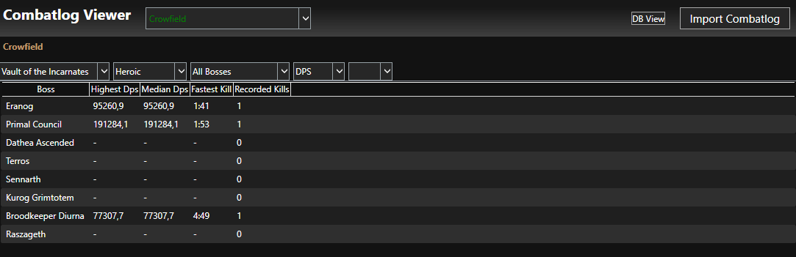
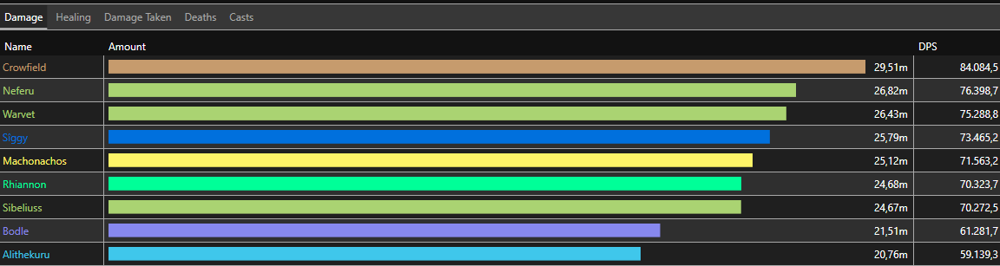

# BasicCombatlogParser

A project with the aim to emulate a subset of the features that https://warcraftlogs.com provides, mainly:
- parsing dps/hps from combat logs
- browse through your previous encounters
- generate ability damage breakdowns (damage done/taken)
- uptime on buffs

I.e. all the smaller-scale features that are just pushing some numbers around and showing them in the GUI.

Fancier things like graphs are not planned as of now, but would be cool tho...

Shoutout to the fandom wowpedia for providing an abundance of info about the various IDs and events in combat logs.

An example of what it looks like during development right now (for my character Crowfield-Silvermoon):

Character Overview:

Encounter breakdown (damage done):

Movement map export (taken from a mythic Terros kill):

## Design in Code n stuff

Using SQLite because it seemed like the simplest available option, using it through EFCore because its simply awesome 
and saves me from a lot of headaches from interacting with SQLite manually. Thanks to whoever came up with ORM.

### Metadata
Metadata is data that is generated and stored by the parser and is currently divided into 4 types:
- Combatlog Metadata
	- Store info about the entire combatlog, such as start time and the file name.
- Encounter Metadata
	- Stores which combatlog it belongs to, which wow encounter id it has, whether it was successful, and a bit more.
- Performance Metadata
	- Stores dps/hps results for players on encounters, pretty straight forward
- Player Metadata
	- Stores a players name, realm, class, and guid.

### Parsing

Parsing is done in multiple steps:
- Create combatlog metadata if the file has not been imported yet.
- Fetch encounter metadata from the file (basically check for ENCOUNTER_START and ENCOUNTER_END events)
- Read each individual encounter into memory and generate hps/dps metrics for the players involved, also create player metadata for all not yet stored in the database.

### Generated Code

I think source generators are pretty neat, currently trialing it for generating EncounterIds, InstanceIds, and everything directly tied to them.
The info that the generator requires is a plaintext list of instances and their encounters.

In an ideal world it would be able to grab that info via the WoW Game API, but dealing with OAuth and all that stuff is something i am not going to bother with.

## Other planned features

Things such as re-importing previously imported combatlog files. This should skip copying the file and should just update all connected data.
(This would not work with logs that a new encounter is being appended to by wow still running, that would need a nicer solution.)

## Who made this and why

I (Toreole) wrote all this code myself, just uhh because it's a lot of fun, somehow.